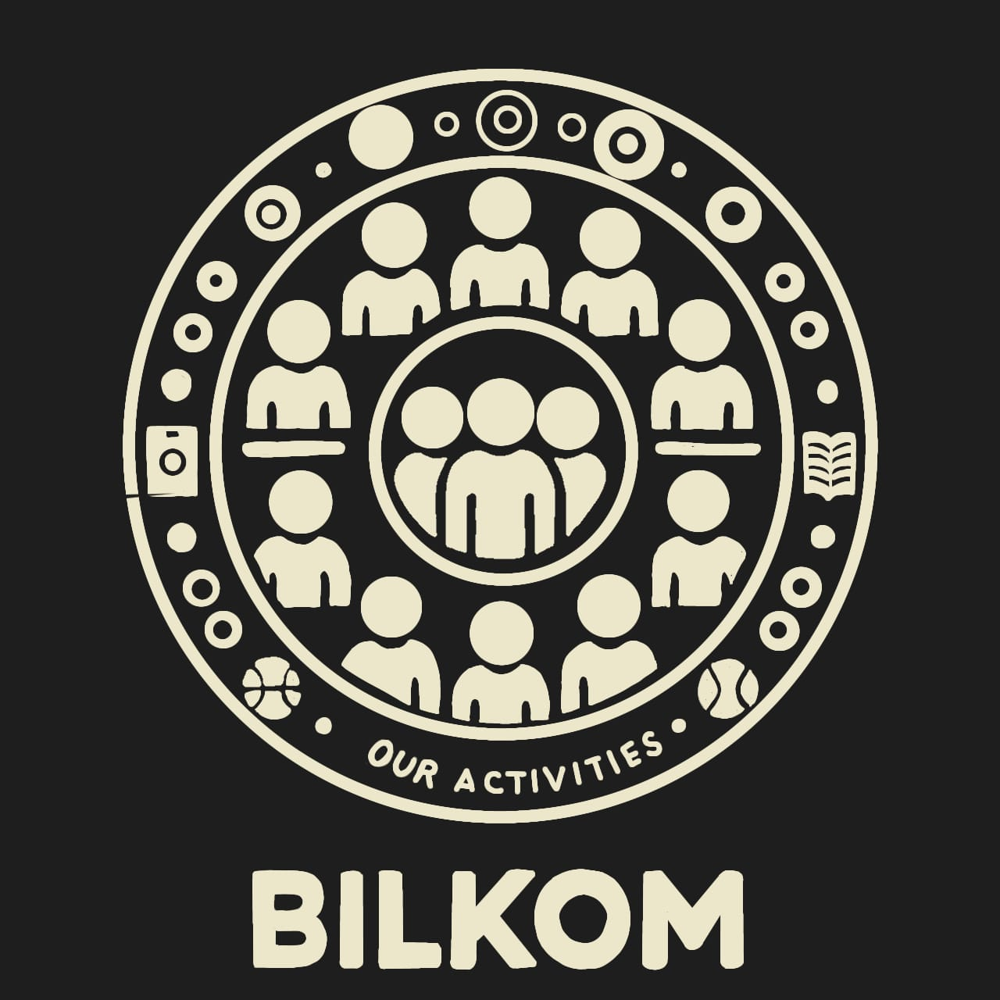

# Bilkom: Enhancing Campus Life at Bilkent University

  

Bilkom is a community-driven platform exclusively for Bilkent University students. Developed as part of our CS102 group project for Spring 2025, Bilkom aims to revolutionize campus connectivity by fostering social interactions, streamlining event management, and ensuring student safety—all within a secure, Bilkent-only environment.

## Table of Contents

- [Overview](#overview)
- [Features](#features)
- [Technologies](#technologies)
- [Usage](#usage)
- [Team](#team)
- [References](#references)
- [License](#license)

## Overview

University life is about more than academic achievement—it’s a time for personal growth, social development, and community engagement. Bilkom addresses the challenges of campus disconnection and isolation by offering a dedicated platform where students can:
- Connect over shared interests and activities.
- Stay informed with real-time weather and campus news.
- Safely coordinate rides and receive emergency alerts.
- Engage with student clubs and manage events efficiently.

By bringing all these features together, Bilkom not only enhances the social and academic experience but also builds a safer, more supportive campus community.

## Features

- **Activity Matching & Shared Interests:**  
  Easily create or join events—ranging from sports to study groups—tailored to your interests.

- **Student Clubs & Event Promotion:**  
  Enable student clubs to advertise their events and activities without relying on outdated methods like posters or generic social media.

- **Emergency Alerts & Community Response:**  
  Get instant notifications during emergencies such as fires, accidents, or urgent health situations.

- **Carpooling & Travel Coordination:**  
  Organize rides for daily commutes or weekend trips, fostering a culture of shared transportation and sustainability.

- **Real-Time Weather & News Feed:**  
  Stay updated with accurate weather forecasts and the latest Bilkent University news directly from the homepage.

- **Robust Reporting System:**  
  Ensure a safe environment with a built-in reporting feature to handle harassment or unwanted behavior swiftly.

## Technologies

### Backend
- **Language & Framework:** Java with Spring Boot  
- **Database:** MySQL / PostgreSQL  
- **ORM:** Hibernate (JPA)  
- **Authentication:** JWT-based authentication using Bilkent email verification  
- **Hosting:** Cloud platforms (AWS, DigitalOcean, or Heroku)  
- **Real-Time Communication:** WebSockets for emergency alerts and messaging

### Frontend
- **Core Technologies:** HTML, CSS, and JavaScript  
- **Styling:** Bootstrap or Tailwind CSS (with optional future enhancements using React.js)  
- **APIs:**  
  - Google Maps API / OpenStreetMap API for carpooling and location services  
  - OpenWeatherMap API for real-time weather updates  
  - RSS Feed Parsing/JSoup for integrating Bilkent news

## Usage

### Register
- Only Bilkent emails (`@bilkent.edu.tr`) allowed  
- Email verification via JWT system

### Setup Profile
- Add interests → get matched with relevant events  
- Interests control homepage suggestions

### Create / Join Event
- Fill title, description, quota, tags  
- Join an event → Get notified when someone else joins too  
- Filter by interest, time, and availability

### Club Announcements
- Clubs post events with quota/time  
- Replaces Instagram/WhatsApp chaos

### Emergency Alerts
- Fire, accident, blood donation, etc.  
- Uses WebSocket for instant broadcast

### Carpooling
- Offer/request ride → verified only  
- Includes GPS + messaging + report button  
- Optional: share live location

### News & Weather Feed
- Pulls news from:
  - [https://bilkentnews.bilkent.edu.tr/](https://bilkentnews.bilkent.edu.tr/)
  - [https://gazetebilkent.com/](https://gazetebilkent.com/)
- Displays real-time weather on homepage via OpenWeatherMap API

---

## Team

**Group0 – CS102 (Spring 2024/2025)**

- **Salih Mert Uzun**
- **Sıla Bozkurt**
- **Elif Bozkurt** 
- **Utku Kabukçu**   
- **Ali İhsan Sevindi** 

